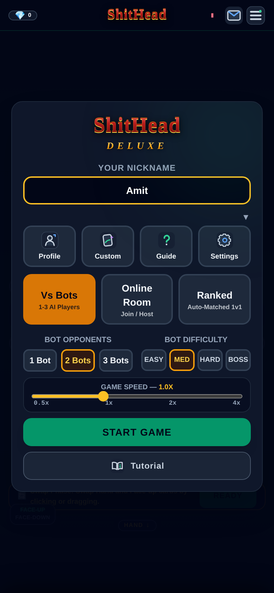
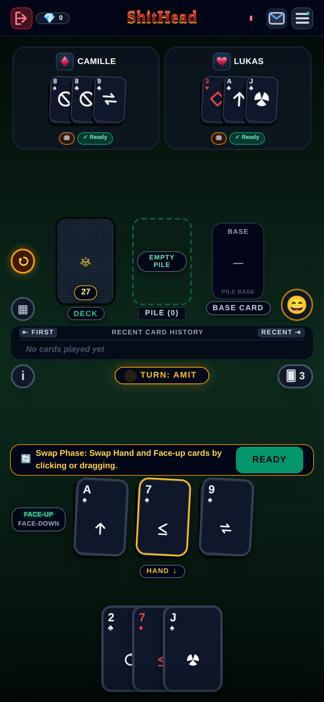
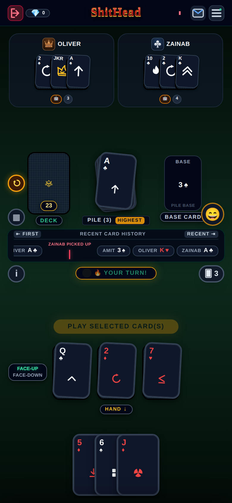
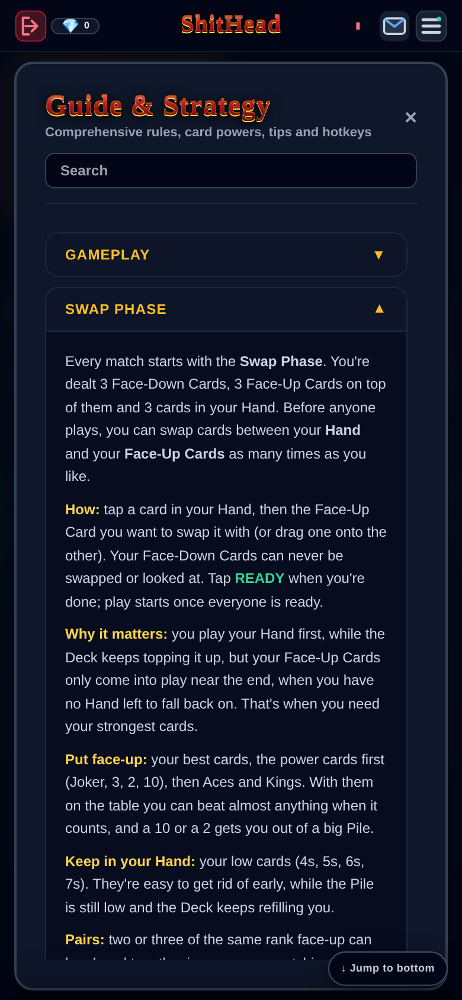
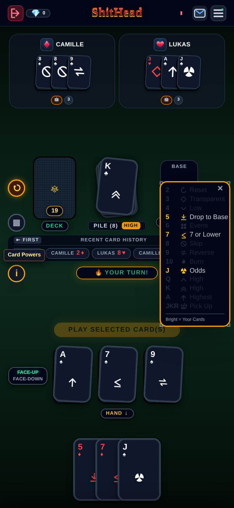
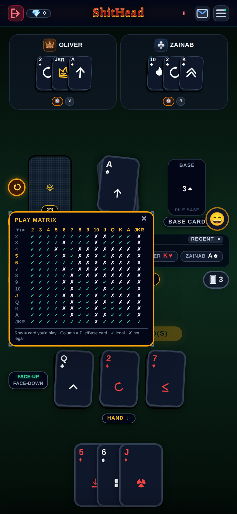

<!-- README-VERSION: v140 — refresh text + screenshots every 15 versions from v150 (v150, v165, v180…); see CLAUDE.md -->
# 💩 ShitHead Deluxe

**The classic card game ShitHead, rebuilt for your phone.** Play against bots, with friends in private rooms, or climb the Ranked ladder. Get rid of all your cards. The last player holding cards is the ShitHead.

### ▶ [Play now at shithead-pro.web.app](https://shithead-pro.web.app/)

Free, no download needed. It runs in any modern browser and installs like an app (Add to Home Screen / Install App), and Vs Bots even works offline.

  
  
  
  

---

## How to play

Everyone is dealt **3 Face-Down cards**, **3 Face-Up cards** on top of them, and **3 cards in their Hand**. The rest form the Deck.

1. **Swap Phase.** Before anyone plays, swap cards between your Hand and your Face-Up cards. Your Face-Up cards are played near the end, when you have no Hand to fall back on, so put your best cards there (Jokers, 3s, 2s, 10s, Aces) and keep low cards in your Hand. Tap **READY** when you're done.
2. **Hand.** Play a card **equal to or higher** than the top of the Pile. After your turn you top back up to 3 from the Deck while it lasts. Can't play? You pick up the whole Pile.
3. **Face-Up.** When your Hand and the Deck are both empty, play your Face-Up cards.
4. **Face-Down.** Last, flip your Face-Down cards blind, one at a time. If the card you flip can't be played, you pick up the Pile.

Four of the same rank in a row **burns** the Pile. So does a 10. Whoever burns plays again.

## Card powers

  
  

Tap the **ⓘ** button during a game for every card's power, and the **▦ Play Matrix** to see which card can go on which (row = your card, column = the Pile; ✓ plays, ✗ doesn't).

| Card | Power |
|---|---|
| **2** ⭐ Reset | Plays on anything except a Jack, and resets the Pile so anything can follow. |
| **3** ⭐ Transparent | Plays on anything except a 6. It's see-through: the next player must beat the card underneath it. |
| **4** Low | The most restrictive card: only goes on a 2, 3, 4, 6 or 7. |
| **5** Drop to Base | The next player must beat the card at the very bottom of the Pile. |
| **6** Evens | The next player must play an even card (2, 4, 6, 8, 10, Q, A or Joker). |
| **7** 7 or Lower | The next player must play a 7 or lower (or a Joker). |
| **8** Skip | Skips the next player; several 8s skip that many. |
| **9** Reverse | An odd number of 9s reverses the direction of play. |
| **10** ⭐ Burn | Burns the whole Pile, and you play again. |
| **J** Odds | The next player must play an odd card (3, 5, 7, 9, J, K or Joker). |
| **Q / K** | Standard high cards. |
| **A** ⭐ | The highest standard card. |
| **Joker** ⭐ Duel | Plays on anything and forces an opponent of your choice to pick up the Pile. If they hold a Joker they can deflect it straight back! |

Card strength, weakest to strongest: **4, 5, 6, 7, 8, 9, J, Q, K, A, 10, 2, 3, Joker.**

## Features

- **Vs Bots** with four difficulties (Easy → Boss) that unlock as you win, playable offline.
- **Online rooms** with friends: share an invite link, chat with emotes, and a bot takes over if someone leaves.
- **Ranked** 1v1 matchmaking with an Elo rating and tiers from Novice to Master.
- **Tutorial**: a one-minute Quick Start plus in-depth lessons for every card.
- **Challenges and Diamonds**: daily and weekly challenges, a login streak and milestones.
- **Shop and Custom**: tables, card backs, frames, burn effects with their own sounds, victory effects, emote packs and profile pictures, plus seasonal events (Halloween, Christmas, Diwali, Lunar New Year and more).
- **Friends**: friend requests, gifts and game invites, with push notifications.
- **Match summary** with stats and a shareable result card.

## Tech

- The whole game is one file, [`index.html`](index.html), with plain JavaScript and no build step.
- It's hosted on **Firebase Hosting**, and every push to `main` deploys automatically.
- **Firebase Realtime Database** handles online rooms, profiles and friends.
- **Firebase Auth** handles sign-in (Google or email).
- **Cloud Functions** ([`functions/`](functions)) handle the economy: Diamonds, purchases, gifts, challenges and Ranked results are checked and saved on the server, so they can't be edited from the browser. The functions also send push notifications.
- A service worker makes the game installable and lets Vs Bots play offline.
- A developer test suite runs in the browser: open `index.html?dev-tests=1`.
