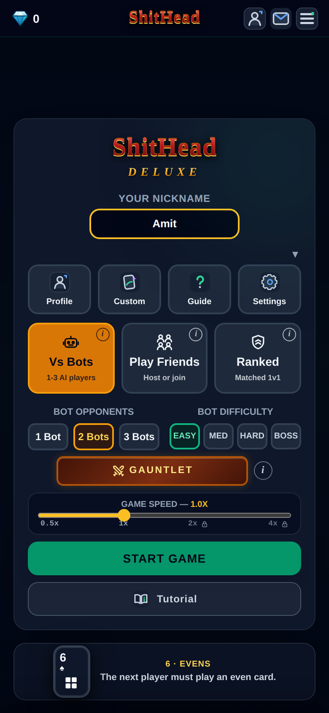
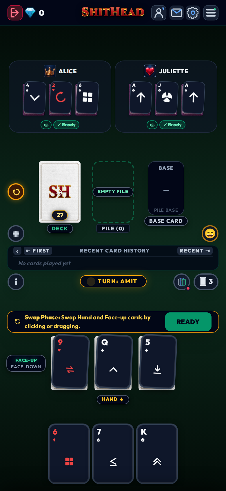
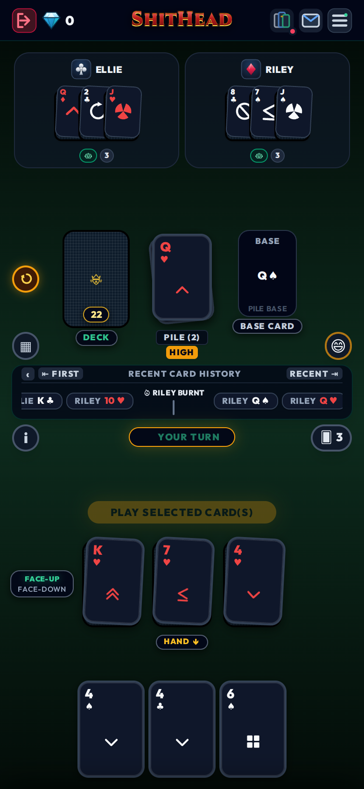
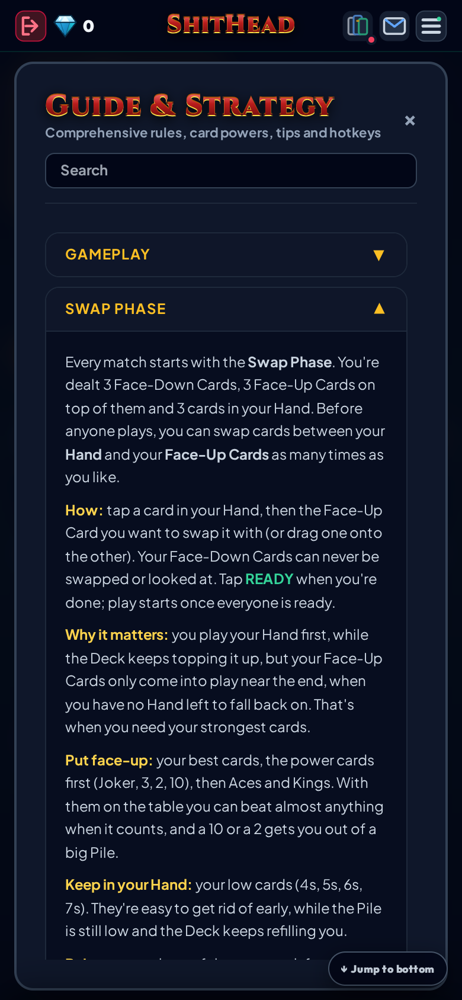
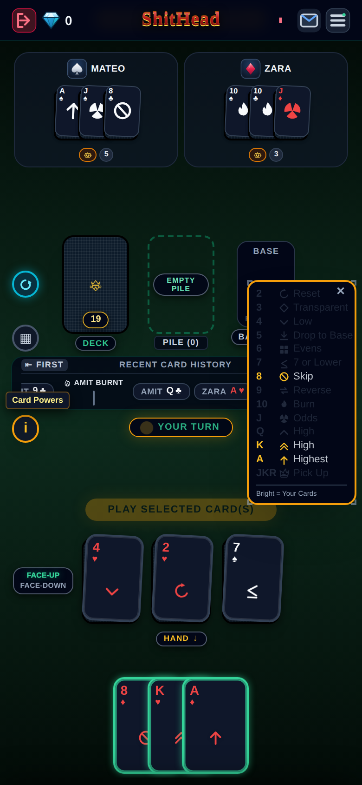
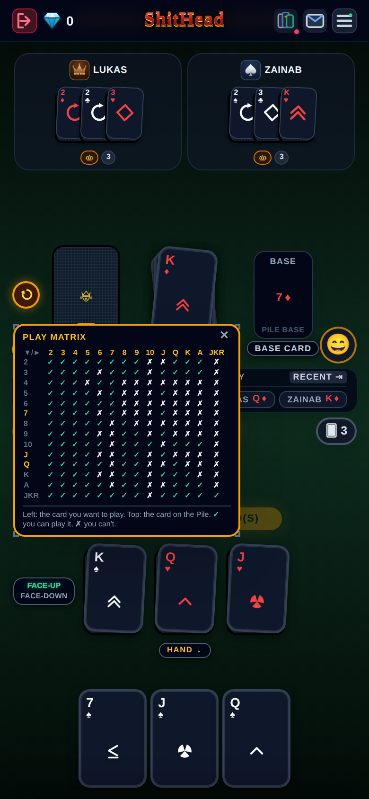

<!-- README-VERSION: v200 — refresh text + screenshots every 20 versions from v180 (v180, v200, v220…); see CLAUDE.md -->
# 💩 ShitHead Deluxe

**The classic card game ShitHead, rebuilt for your phone.** Play against bots, play friends in private rooms, or climb the Ranked ladder. Get rid of all your cards. The last player holding cards is the ShitHead.

### ▶ [Play now at shithead-pro.web.app](https://shithead-pro.web.app/)

Free, no download needed. It runs in any modern browser on phones, foldables, tablets and computers, installs like an app (Add to Home Screen / Install App), and Vs Bots even works offline.

  
  
  
  

---

## How to play

Everyone is dealt **3 Face-Down cards**, **3 Face-Up cards** on top of them, and **3 cards in their Hand**. The rest form the Deck.

1. **Swap Phase.** Before anyone plays, swap cards between your Hand and your Face-Up cards. Your Face-Up cards are played near the end, when you have no Hand to fall back on, so put your best cards there (Jokers, 3s, 2s, 10s, Aces) and keep low cards in your Hand. Tap **READY** when you're done.
2. **Hand.** Play a card **equal to or higher** than the top of the Pile. After your turn you top back up to 3 from the Deck while it lasts. Can't play? You pick up the whole Pile.
3. **Face-Up.** When your Hand and the Deck are both empty, play your Face-Up cards.
4. **Face-Down.** Last, flip your Face-Down cards blind, one at a time. If the card you flip can't be played, you pick up the Pile.

Four of the same rank in a row **burns** the Pile. So does a 10. Whoever burns plays again, unless that was their last card: then they finish and the next player carries on.

## Card powers

  
  

Tap the **ⓘ** button during a game for every card's power, and the **▦ Play Matrix** to see which card can go on which: find your card down the left and the Pile's card along the top, and a tick means it plays. **Press and hold any card** (in your hand, on the table or on the Pile) to read what it does and whether you can play it right now. When a 3 is on top, the Pile label shows what you really have to beat (for example *Transparent - Q*), and the card history circle shows the card to beat at a glance.

| Card | Power |
|---|---|
| **2** ⭐ Reset | Plays on anything except a Jack, and resets the Pile so anything can follow. |
| **3** ⭐ Transparent | Plays on anything except a 6. It's see-through: the next player must beat the card underneath it. |
| **4** Low | The most restrictive card: only goes on a 2, 3, 4, 6 or 7. |
| **5** Drop to Base | The next player must beat the card at the very bottom of the Pile. |
| **6** Evens | The next player must play an even card (2, 4, 6, 8, 10, Q, A or Joker). |
| **7** 7 or Lower | The next player must play a 7 or lower (or a Joker). |
| **8** Skip | Skips the next player; several 8s skip that many. |
| **9** Reverse | An odd number of 9s reverses the direction of play. |
| **10** ⭐ Burn | Burns the whole Pile, and you play again. |
| **J** Odds | The next player must play an odd card (3, 5, 7, 9, J, K or Joker). |
| **Q / K** | Standard high cards. |
| **A** ⭐ | The highest standard card. |
| **Joker** ⭐ Duel | Plays on anything and forces an opponent of your choice to pick up the Pile. If they hold a Joker they can deflect it straight back! |

Card strength, weakest to strongest: **4, 5, 6, 7, 8, 9, J, Q, K, A, 10, 2, 3, Joker.**

## Features

- **Vs Bots** with four difficulties (Easy → Boss) that unlock as you win, playable offline. Close the app mid-game and it picks up exactly where you left off.
- **The Gauntlet**: beat 5 bots in a row (Easy, Easy, Medium, Hard, Boss) with 3 lives. The first clear wins an exclusive picture and frame, then Diamonds every day you beat it again.
- **Play Friends**: private rooms for up to 4 players. Share an invite link, react with emotes, and a bot takes over if someone leaves. Friends can watch your match live.
- **Ranked** 1v1 matchmaking with an Elo rating and tiers from Novice to Master. The deck is shuffled by the server and every move is checked.
- **Tutorial**: a one-minute Quick Start (including press-and-hold card info) plus in-depth lessons for every card, and a searchable Guide (rules, card powers, the Gauntlet, key terms).
- **Challenges and Diamonds**: daily and weekly challenges, the Daily Gauntlet, a login streak and milestones. During every seasonal event a Seasonal tab adds four big event-long challenges and a Season Complete bonus. Tap your completed count to see every challenge you've finished.
- **Shop and Custom** (each opens on an All tab with every item in folding sections): tables, card backs, frames, burn effects with their own sounds, **Joker effects** (a short animation over the table whenever you play a Joker: Jester's Grin, Jack-in-the-Box, Magic Trick, Glitch and more, plus a Pumpkin Joker, Santa Joker and others for each seasonal event), victory effects, emote packs and profile pictures, plus seasonal events (Halloween, Christmas, Diwali, Lunar New Year and more). Premium items too: animated pictures (Royal Flush, Phoenix, Cosmic Ace), vector tables (Neon City, Northern Lights, Deep Space), cinematic burns, Joker and victory effects, and card backs like Dragon Scale and Stained Glass. **Decks** change the card faces (Lavender, Paper Classic, Blueprint, Chalkboard, Frosted Glass, Neon Night, Royal Gold and more). Earn-only pictures and frames for Ranked tiers, the Gauntlet and recruiting friends. All art is vector or high-resolution, so it stays sharp on 4K screens. Two free tables (Oak Wood and Classic Felt), up to 3 saved looks you can switch in one tap, and a **Collection** page showing everything you own and how to get the rest.
- **Friends**: friend requests, gifts, game invites and a public showcase of your look (deck included), with push notifications and an online status that only shows while the game is actually open. Invite friends with your own link and you both earn Diamonds once they've played a few games.
- **Leaderboards**: Ranked rating, challenges completed and Gauntlet bots beaten, with an Inbox message when you reach the top 10, #3, #2 or #1. Tap anyone to open their profile, add them as a friend or ignore them (ignored players drop off the boards).
- **Match summary** with stats and a shareable result card, plus a full match history.
- **Built for every screen**: the hand resizes to fill your screen, the table grows on tablets and computers, foldables are supported (a small cover screen asks you to open the phone), and a phone turned sideways asks to be turned upright. Settings (Hand Sort, Turn Alert, Card History, Show Others' Effects and more) follow your account across devices, and an accessibility **Big Print** deck gives large, high-contrast ranks that stay readable in any hand.
- **Always up to date**: when a new version is out, the game offers to update itself, and a game in progress carries on afterwards.
- **Your data**: download everything stored about your account, or delete it (with 7 days to change your mind).

## Tech

- The whole game is one file, [`index.html`](index.html), with plain JavaScript and no build step.
- It's hosted on **Firebase Hosting**, and every push to `main` deploys automatically.
- **Firebase Realtime Database** handles online rooms, profiles and friends.
- **Firebase Auth** handles sign-in (Google or email).
- **Cloud Functions** ([`functions/`](functions)) handle the economy: Diamonds, purchases, gifts, challenges, the Gauntlet, referrals and Ranked results are checked and saved on the server, so they can't be edited from the browser. They also deal Ranked games, audit every Ranked move, keep the leaderboards, and send push notifications.
- A service worker makes the game installable and lets Vs Bots play offline.
- A developer test suite runs in the browser: open `index.html?dev-tests=1`.
